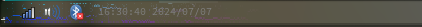

# shaderbar - the statusbar I always wanted

This is a simple statusbar that I made for myself when switching from [i3](https://github.com/i3/i3) to [sway](https://github.com/swaywm/sway).

Originally a LUA script for [ironbar](https://github.com/JakeStanger/ironbar), I decided to rewrite it in rust to make it more efficient and easier to maintain. I also needed a project to learn rust, so it was a win-win :D

## Features

- Uses glsl shaders for theming (awesome eye-candy)
- Makes various sensors available
  - Time
  - Battery
  - CPU
  - GPU
  - Memory
  - Disk
  - Network

## In development

- [x] Configuration file
- [x] Styling (css, glsl)
- [x] Basic sensors (very specific to my system xD)
- [x] Default shader (uniforms are going to change, stupid opengl es)
- [x] Sensor Detection
- [ ] Sensor Configuration
- [x] Tray (so far, so good)
- [x] Wallpaper (it was a joke, but it's there now xD)
- [ ] Notifications (escalating quickly xD)

## License

This project is licensed under the MIT License - see the [LICENSE](LICENSE) file for details.

## Acknowledgments

   - This project incorporates fragments from **ironbar**, 
     which is licensed under the **MIT License**. 
     *Copyright (c) 2022 Jake Stanger et al.* 
     Source available at: https://github.com/JakeStanger/ironbar
